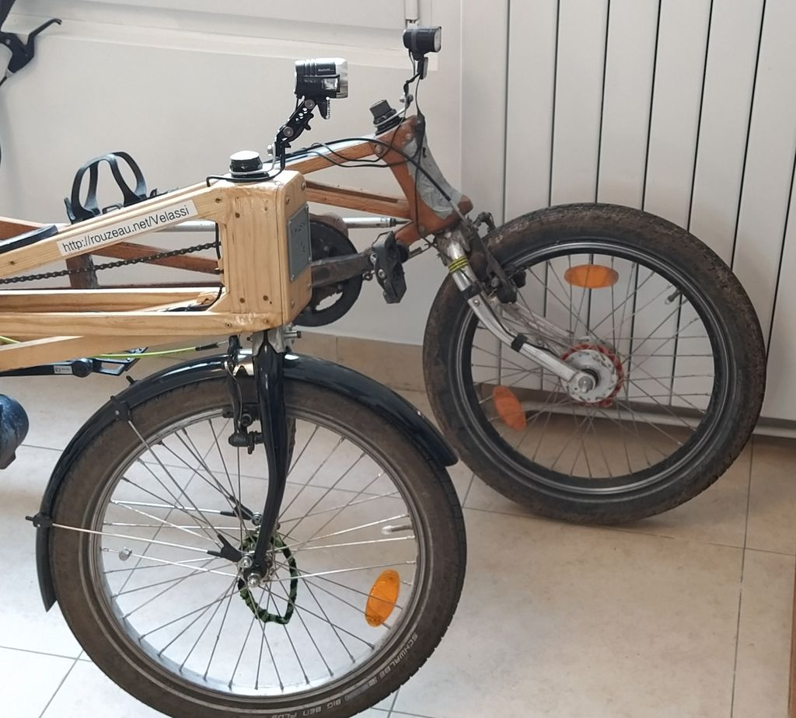

# CycleForkAnimated
 Creates an animation of a bicycle fork geometry with either Fixed trail or Fixed angle
 Having built a bike with a very vertical steering, most people don't understand how it works and an animation seemed the best way to explain the interdependance of parameters in cycle fork geometry.\
 This is programmed with OpenSCAD, components are those of my recumbent cycle simulator BentSim (published in my account)
 Openscad allow parametric image based on a time variable and can automatically export it. These images are then assembled in a unique gif file, 
 with time between images of 20 ms and an extended step of 130 ms fort the first and middle image (when going back), so image 1 and 31 for the fixed trail (60 images) and 1 and 26 for the fixed angle (50 images).\

\
The above images also exist in French, Spanish and Italian, see in the '/Images' directory \
  \ 
For general considerations about cycle geometry, you may have a look on the Wikipedia page:\
https://en.wikipedia.org/wiki/Bicycle_and_motorcycle_geometry \
Please be aware though, about the quite important concept of 'Wheel flop' that the given formula, while got from a renowned magazine is just plain wrong. See discussion page for details.\ 
  \
As for cycle steering design, you may refer to the work done by Tony Foale on a BMW motorbike testing a full range of steering angle. His conclusion is that the handling improve with more vertical steering, but that over 80° steering angle (10° rake angle), the increased benefit became fairly low:\
https://motochassis.com/articles/experiments-with-steering-geometry/
  \
An original recumbent designed to have very good low speed stability, with explanation why this work (designed with a totally vertical steering).\
https://rothrockcyrcle.wordpress.com/2020/09/26/steering-geometry-of-short-wheelbase-recumbent-bikes/
  \
A video with the late Mike Burrows (very renowned cycle designer) about the best steering angle for him (spoiler: vertical):\
https://www.youtube.com/watch?v=AZrvLdX7B3E
  \
I shall not set aside my own experience of designing two long wheelbase (LWB) recumbent bikes with very different steering angle, the first one very reclined as is common on most LWB with a steering angle of 58° and the second with a much more vertical angle of 82° (with an indirect steering). I can confirm the handling is much better with the more vertical steering. For the first version at 58°, increasing the offset and reducing the trail might have improved low speed handling at the price of less stability at high speed. In practice, I installed a steering spring which have substantially improved the low speed handling. Quite an artifice but what count is what works.

  \
You can find details about these bikes here (also available in french):\
https://rouzeau.net/TheVelassi  \
  \
On my github Account, you will also find a geometry recumbent simulator for either bike or trike, also capable of simulate an ordinary bicycle.\
https://github/PRouzeau/BentSim

 
  

